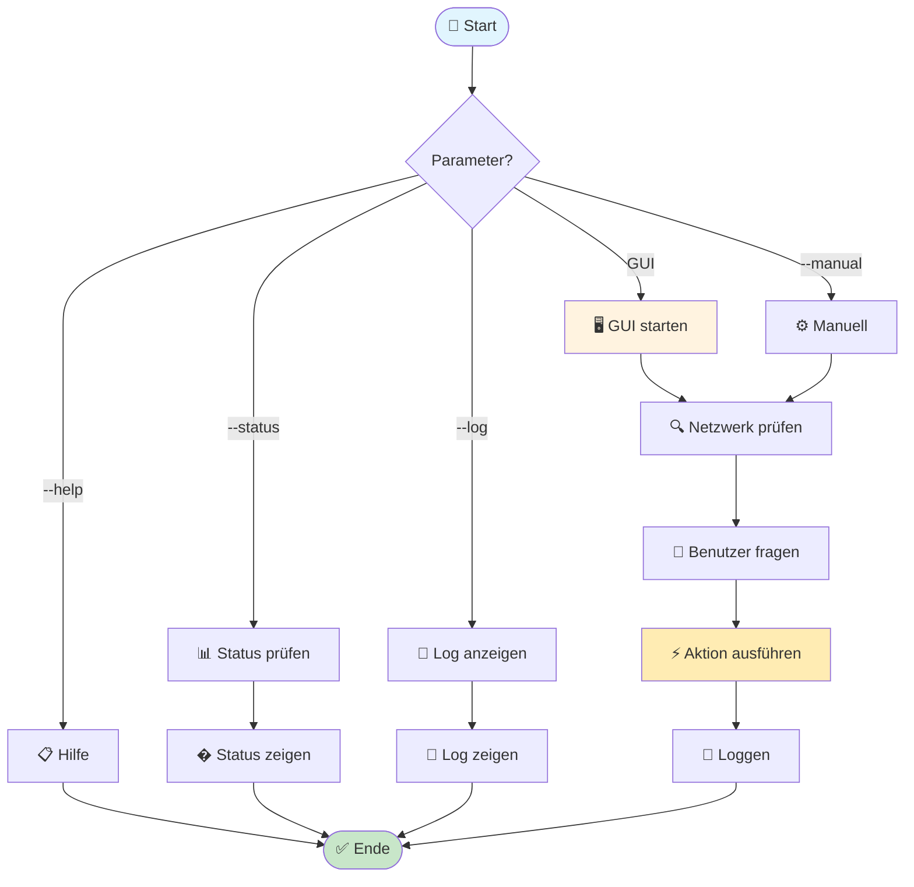
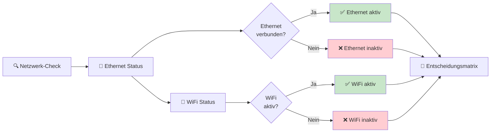
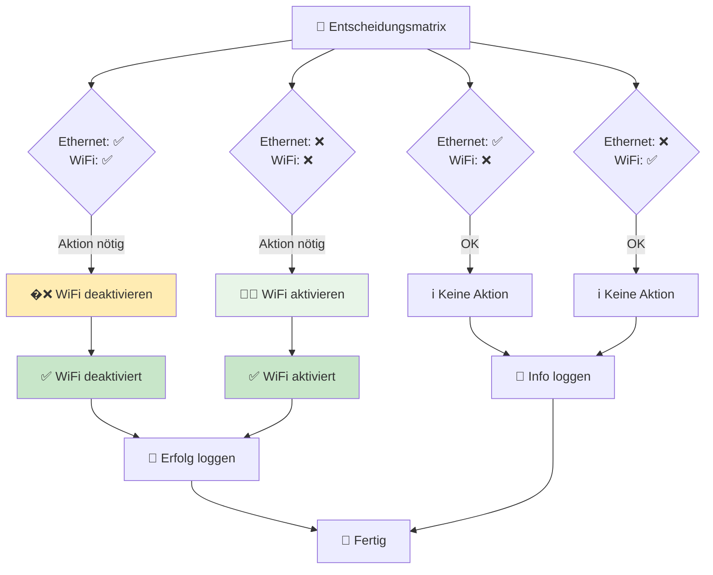
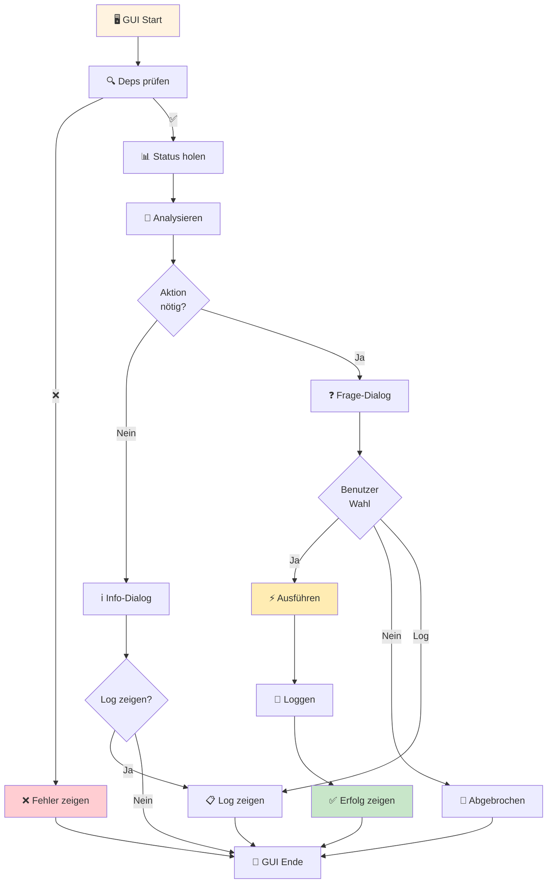
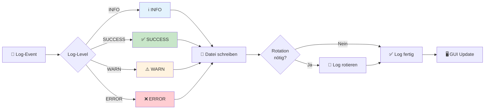
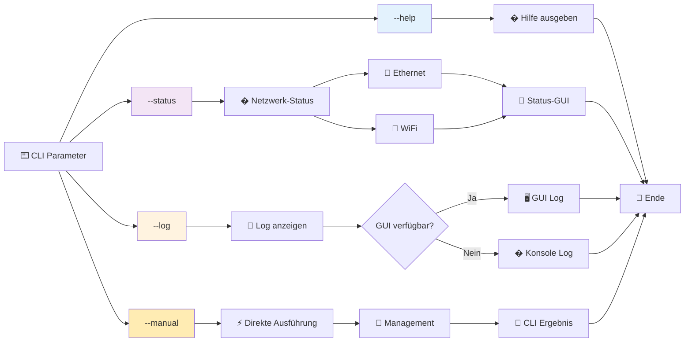
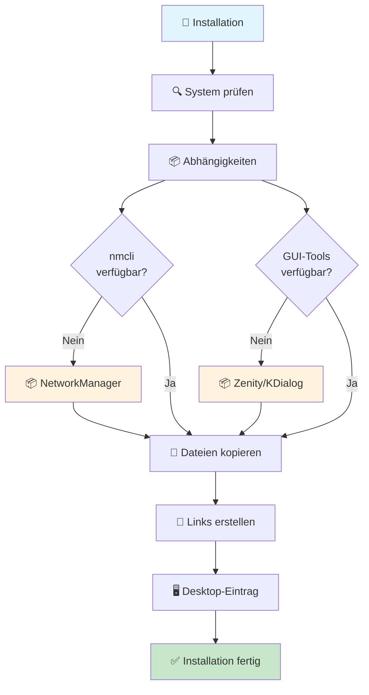

# Smart WiFi Controller - Programmablaufplan

## � Übersicht - Hauptkomponenten

## 🔌 Netzwerk-Erkennung

## ⚡ Aktions-Matrix

## 🖥️ GUI-Workflow (kompakt)

## 📝 Log-System

## 🔧 Kommandozeilen-Modi (Details)

## ⚙️ Systemintegration

---
*Erstellt für Smart WiFi Controller v1.0 - November 2025*