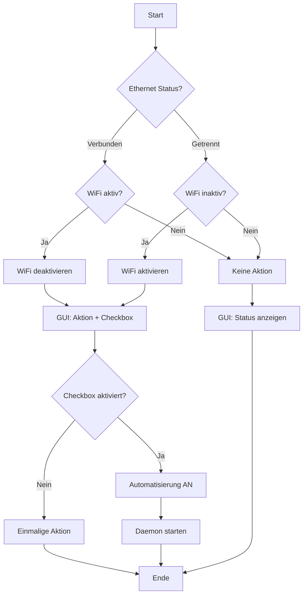

# 🔗 Network Manager - Projekt Übersicht

## 🎯 Projektbeschreibung

Ein vollständiges System zur automatischen Verwaltung von WiFi- und Ethernet-Verbindungen unter Linux. Das System erkennt intelligent Netzwerkverbindungen und deaktiviert WiFi automatisch, wenn Ethernet verfügbar ist.

## 📁 Dateien-Übersicht

| Datei | Beschreibung | Status |
|-------|-------------|--------|
| `network_manager.sh` | 🎯 **Hauptscript** - Kernlogik mit GUI | ✅ Fertig |
| `install.sh` | 📦 **Installer** - System-/Benutzerinstallation | ✅ Fertig |
| `test.sh` | 🧪 **Test-Suite** - Systemvalidierung | ✅ Fertig |
| `init.sh` | 🚀 **Initialisierung** - Projekt-Setup | ✅ Fertig |
| `README.md` | 📖 **Dokumentation** - Vollständige Anleitung | ✅ Fertig |
| `PSEUDOCODE_README.md` | 🔧 **Technische Docs** - Architektur | ✅ Fertig |
| `.claude.md` | 🤖 **AI-Context** - Claude Dokumentation | ✅ Fertig |
| `PROJECT_OVERVIEW.md` | 📋 **Diese Datei** - Schnellübersicht | ✅ Fertig |

## 🚀 Schnellstart

### 1. Projekt initialisieren
```bash
./init.sh
```

### 2. System testen
```bash
./test.sh
```

### 3. Installation
```bash
# Systemweit (empfohlen)
sudo ./install.sh

# Oder nur für aktuellen Benutzer
./install.sh
```

### 4. Erste Nutzung
```bash
network-manager
```

## ⚡ Hauptfunktionen

### 🔄 Automatische Netzwerkverwaltung
- ✅ **Ethernet erkannt** → WiFi deaktivieren
- ✅ **Ethernet getrennt** → WiFi aktivieren  
- ✅ **Intelligent** → Nur bei Bedarf handeln

### 🖥️ Benutzerfreundliche GUI
- ✅ **Zenity/KDialog** Support
- ✅ **"Immer so"**-Checkbox für Automatisierung
- ✅ **Klare Dialoge** mit Status-Informationen

### ⚙️ Automatisierung
- ✅ **Daemon-Modus** für Hintergrundausführung
- ✅ **Autostart-Integration** beim Systemstart
- ✅ **Persistente Konfiguration** in `~/.config/`

### 🔧 Erweiterte Features
- ✅ **Desktop-Integration** (Menü-Eintrag)
- ✅ **Logging** für Debugging
- ✅ **Multi-Distro** Support
- ✅ **Keine Root-Rechte** für normale Nutzung

## 📋 Systemanforderungen

| Komponente | Status | Installation |
|------------|--------|-------------|
| **Linux** | ✅ Erforderlich | - |
| **NetworkManager** | ✅ Erforderlich | `sudo apt install network-manager` |
| **Zenity/KDialog** | ⚠️ Empfohlen | `sudo apt install zenity` |
| **Bash** | ✅ Standard | - |

## 🎮 Verwendung

### Interaktive Modi
```bash
network-manager              # GUI-Modus (Standard)
network-manager --status     # Status anzeigen
network-manager --help       # Hilfe
```

### Automatisierung
```bash
network-manager --enable-auto   # Automatik AN
network-manager --disable-auto  # Automatik AUS
network-manager --daemon        # Daemon-Modus
```

### Installation/Test
```bash
./init.sh           # Projekt initialisieren
./test.sh           # System testen
sudo ./install.sh   # Installieren
```

## 🔍 Funktionsweise



## 📊 Projekt-Status

### ✅ Abgeschlossen
- [x] Kernfunktionalität implementiert
- [x] GUI-Interface mit Checkbox
- [x] Automatisierungsfunktion
- [x] Daemon-Modus
- [x] Konfigurationsverwaltung
- [x] Desktop-Integration
- [x] Installations-System
- [x] Test-Suite
- [x] Vollständige Dokumentation
- [x] Claude AI Context

### 🚀 Bereit für Nutzung
Das System ist **produktionsreif** und kann sofort eingesetzt werden!

## 🔧 Architektur-Highlights

### Modular Design
```
📦 Network Manager
├── 🧠 Core Logic (Netzwerkerkennung)
├── 🖼️ GUI Layer (Zenity/KDialog)
├── ⚙️ Config Management (User-basiert)
├── 🔄 Daemon Engine (Hintergrund)
└── 🔌 System Integration (Desktop)
```

### Intelligente Erkennungslogik
- **NetworkManager Integration** über `nmcli`
- **Zustandsbasierte Entscheidungen**
- **Vermeidung unnötiger Aktionen**
- **Robuste Fehlerbehandlung**

### Cross-Platform GUI
- **Primär**: Zenity (GNOME/GTK)
- **Fallback**: KDialog (KDE/Qt)  
- **Graceful Degradation** bei fehlendem GUI

## 🛠️ Wartung & Support

### Logs & Debugging
```bash
# Log-Datei anzeigen
tail -f /tmp/network_manager.log

# Konfiguration prüfen
cat ~/.config/network_manager_config

# Status diagnostizieren
network-manager --status
```

### Konfigurationsdateien
- **User Config**: `~/.config/network_manager_config`
- **Autostart**: `~/.config/autostart/network_manager.desktop`
- **Logs**: `/tmp/network_manager.log`

### Deinstallation
```bash
# Systemweit
sudo rm /usr/local/bin/network-manager
sudo rm /usr/share/applications/network-manager.desktop

# Benutzerdaten
rm ~/.config/network_manager_config
rm ~/.config/autostart/network_manager.desktop
```

## 📈 Zukünftige Erweiterungen

### Mögliche Features
- 📱 **Mobile Hotspot** Integration
- 🔐 **VPN** Management  
- ⏰ **Zeitbasierte** Regeln
- 🌐 **Netzwerkprofile** (Arbeit/Zuhause)
- 📊 **Verbrauchsstatistiken**

### Packaging
- 📦 **Debian Package** (.deb)
- 🔴 **RPM Package** (.rpm)
- 📸 **Snap Package**
- 💫 **Flatpak Support**

## 👥 Für Entwickler

### Code-Qualität
- ✅ **Konsistenter Stil** (snake_case)
- ✅ **Umfassende Kommentierung**
- ✅ **Fehlerbehandlung**
- ✅ **Modulares Design**

### Testing
- ✅ **Automatisierte Tests**
- ✅ **Dependency Checking**
- ✅ **Safe Simulation Mode**

### Dokumentation
- ✅ **User Documentation** (README.md)
- ✅ **Technical Docs** (PSEUDOCODE_README.md)
- ✅ **AI Context** (.claude.md)
- ✅ **Code Comments** (Inline)

---

## 📞 Support

**Repository**: BashScripts/disableWifiOnWiredConnection  
**Author**: dajuly20  
**Version**: 1.0.0  
**License**: MIT  

**Erstellt mit 💡 und Claude AI am 15. November 2025**